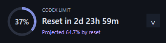
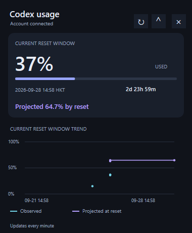

# Codex Token Overlay

A lightweight Windows overlay for Codex quota percentages, reset countdowns and usage forecasts, with optional Claude Code 5-hour usage. The current **v0.2.1 native version** uses C++20, Win32, Direct2D and DirectWrite. It does not ship Electron, Node.js or WebView. The earlier Electron v0.1.15 source remains available for comparison and rollback.

This is an independent project, not an official OpenAI product. A working, signed-in Codex installation with `codex app-server` support is required; the overlay does not include Codex or provide an account.



<details>
<summary>Expanded view (synthetic test data)</summary>



</details>

## Features

- Current quota percentage, reset countdown and reset time in HKT (UTC+8).
- Estimated quota usage at reset, recorded observations and historical forecasts.
- Additional quota buckets, chart tooltips, manual refresh and automatic reconnect.
- Always-on-top mode, dragging, system tray, hide/restore and optional Start with Windows.
- Per-monitor DPI support; centered ring percentage and a shared expand/collapse button position.
- Optional Claude Code 5-hour quota, reset countdown and last-received status through the official status line.
- Compact 340 x 88 DIP view, or 340 x 124 DIP with Claude connected. Expanded view is 380 DIP wide and 460/480/500 DIP tall, depending on additional quota rows.

Quota data refreshes every minute and on App Server notifications. The forecast extrapolates the current reset window's average consumption pace; it is an estimate, not a guarantee of future usage. Unknown or expired values show N/A. Offline or stale data retains recorded history but hides the current forecast extension.

During the first six hours of a reset window longer than six hours, the native overlay labels the card forecast **Early estimate**. These early forecasts remain stored and available in observed-point tooltips, but are excluded from the forecast curve, reset endpoint and chart scale. Observed usage remains visible throughout. Forecast plotting starts with the first valid reading at or after six hours; shorter windows retain their existing behavior. This is a display filter, not smoothing or a change to the forecast calculation.

## Build the native version

Use Windows x64 with:

- Visual Studio 2022 Build Tools: MSVC v143 x64, Windows SDK 10.0.26100 and C++ CMake tools (CMake 3.25+).
- Node.js (tested with 24.19.0) and pnpm 10.7.1 for icon generation, cross-language tests and NSIS packaging. These are development tools, not runtime requirements of the native EXE.
- A signed-in Codex installation for live quota reads.

Run from the repository root in PowerShell:

```powershell
pnpm install --frozen-lockfile
node scripts/generate-icon.mjs
powershell -NoProfile -ExecutionPolicy Bypass -File scripts/build-native.ps1 -Test
& '.\build\native\Release\Codex Token Overlay.exe'
```

Close any older overlay before starting against the same profile. Codex is discovered from its local app installation or `PATH`; you can explicitly select it for the current shell:

```powershell
$env:CODEX_EXECUTABLE = 'C:\path\to\codex.exe'
```

The checked-in `nlohmann/json` 3.12.0 header has pinned provenance, SHA256 and license in [native/third_party](native/third_party/README.md). The Release binary uses the static C++ runtime.

## Package and install

After generating the icon and installing development dependencies:

```powershell
powershell -NoProfile -ExecutionPolicy Bypass -File scripts/package-native.ps1
```

Outputs:

- `release/native/win-unpacked/Codex Token Overlay.exe`
- `release/native/Codex-Token-Overlay-0.2.1-Setup.exe`

Packaging does not install or launch an upgrade. The NSIS installer is per-user and unsigned. Close the old overlay, then run the installer to update it. Generated installers are excluded from Git; build locally unless a binary has been explicitly published as a GitHub release asset.

The product/App ID and startup entry remain `com.local.codextokenoverlay`. The native executable and Electron version share an exclusive profile lock to prevent simultaneous writes. Unrelated Codex processes are not terminated.

## Connect Claude Code

Claude Code v2.1.251 or newer can supply its subscription's 5-hour quota through the [official status line](https://code.claude.com/docs/en/statusline#rate-limit-usage). The bundled `setup-claude-statusline.ps1` connects it using your selected overlay executable. It backs up Claude settings, preserves hooks and other fields, and refuses to replace an unrelated status line. See [setup and rollback instructions](docs/CLAUDE.md).

Claude usage appears after the first API response. Updates follow Claude Code status-line events. After five minutes without a reading, the overlay marks it **Last synced**; the reset countdown continues. When that window ends, usage shows **N/A** until a new reading arrives. The overlay receives the account's 5-hour quota; it does not calculate a per-conversation token percentage or add concurrent sessions together.

## Data, privacy and rollback

The active runtime reads `account/rateLimits/read` from one local Codex App Server over JSON-RPC. Claude integration reads only its separate local usage cache, written by `--claude-statusline` from Claude Code's official stdin payload. The bridge does not read Claude credentials or contact Anthropic APIs, and stores no prompts or transcripts. It does not scan conversation/session files, request account token usage, or refresh pricing. Legacy session/pricing code remains in the Electron source for compatibility and tests.

Settings, position, quota snapshots and history live in `%APPDATA%\codex-token-overlay\quota-state.json` (schema v1). The overlay uses Codex's existing authentication through App Server; it does not ask you to paste credentials into the overlay. App Server retains its own Codex authentication and network behavior.

- History stores at most one observation per minute, up to 10,080 observations, for the active primary reset window.
- Chart lines break across gaps longer than two minutes or missing forecasts. Older observations without forecasts remain readable.
- First native replacement saves `quota-state.json.pre-native.bak`; subsequent writes use a flushed temporary file and atomic replacement. Invalid data is reported without overwriting the original.
- Legacy usage state is read only for migration. Existing files are preserved.
- Position uses Electron-compatible DIP coordinates plus optional native monitor metadata; v0.1.15 ignores that metadata.

For rollback, close the native overlay and reinstall your retained v0.1.15 installer. The v1 data remains readable by that version. Back up your current data before manually restoring an older snapshot, which would discard newer history.

Do not commit local credentials, `.env` files, quota state, logs or diagnostic captures. Build outputs, installers, test profiles and raw measurements are excluded by `.gitignore`.

## Validation and resource measurements

The packaged v0.2.1 native build, with Claude connected and about 7,400 Codex observations, used **35.27 MiB / 42.54 MiB / 42.56 MiB peak combined Private Working Set** in collapsed / expanded / hidden states, including its real App Server and conhost. Each state was sampled for two minutes after two minutes of warmup. All 73 samples were <=50 MiB, and mean machine CPU was below 0.02%. A separate short-warmup diagnostic caught a 69.61 MiB App Server startup spike before it settled; the stable measurements do not establish a startup memory cap.

Native assertions, TypeScript parity, setup/undo, Codex-offline Claude updates and UI checks at synthetic 100%, 150% and 200% DPI passed. Real Claude output matched `/usage`, and an isolated copy retained its percentage, countdown and `Last synced` after five minutes. The default ten-minute-per-state benchmark and a long soak were not repeated for v0.2.1. See [validation details and limits](docs/VALIDATION.md), including the older, longer measurements. These are local results, not a guarantee for every system or Codex version.

Core, TypeScript parity and UI checks:

```powershell
powershell -NoProfile -ExecutionPolicy Bypass -File scripts/build-native.ps1 -Test
$env:NATIVE_TEST_EXE = (Resolve-Path 'build/native/Release/overlay_tests.exe').Path
pnpm test
pnpm typecheck
powershell -NoProfile -ExecutionPolicy Bypass -File scripts/test-native-ui.ps1
powershell -NoProfile -ExecutionPolicy Bypass -File scripts/test-native-claude.ps1
```

UI and measurement scripts create isolated profiles from an existing local overlay state. Run the overlay at least once first, and keep the desktop unlocked during visible tests. They do not change the real startup entry. Isolated operation requires both `CODEX_OVERLAY_E2E=1` and `CODEX_OVERLAY_E2E_USER_DATA`; the scripts set these automatically.

```powershell
$exe = (Resolve-Path 'release/native/win-unpacked/Codex Token Overlay.exe').Path
powershell -NoProfile -ExecutionPolicy Bypass -File scripts/measure-native.ps1 -Executable $exe -Mode performance
powershell -NoProfile -ExecutionPolicy Bypass -File scripts/measure-native.ps1 -Executable $exe -Mode soak -SoakMinutes 30
```

Performance mode measures all owned processes every five seconds and requires every stable sample <=50 MiB Private Working Set and mean machine CPU <=0.1%. The separate fixed-data soak performs 100 hide/show cycles and records RAM, handles and GDI/USER resources; use `-SoakMinutes 60` for one hour. No forced working-set trimming is used. Raw results and tested binary hashes remain local under `test-results/`.

## Retained Electron implementation

`package.json` stays at **0.1.15** for the Electron fallback; native CMake/resources and `electron-builder.native.json` define **0.2.1**. The two build paths are intentional.

```powershell
pnpm install --frozen-lockfile
pnpm dev
pnpm build
pnpm dist
pnpm test:e2e
```

`pnpm dist` builds the Electron installer under `release/`; `pnpm dist:native` builds the native installer under `release/native/`.

## License

[MIT](LICENSE). See [THIRD_PARTY_NOTICES](THIRD_PARTY_NOTICES) and the vendored JSON license for third-party components.
